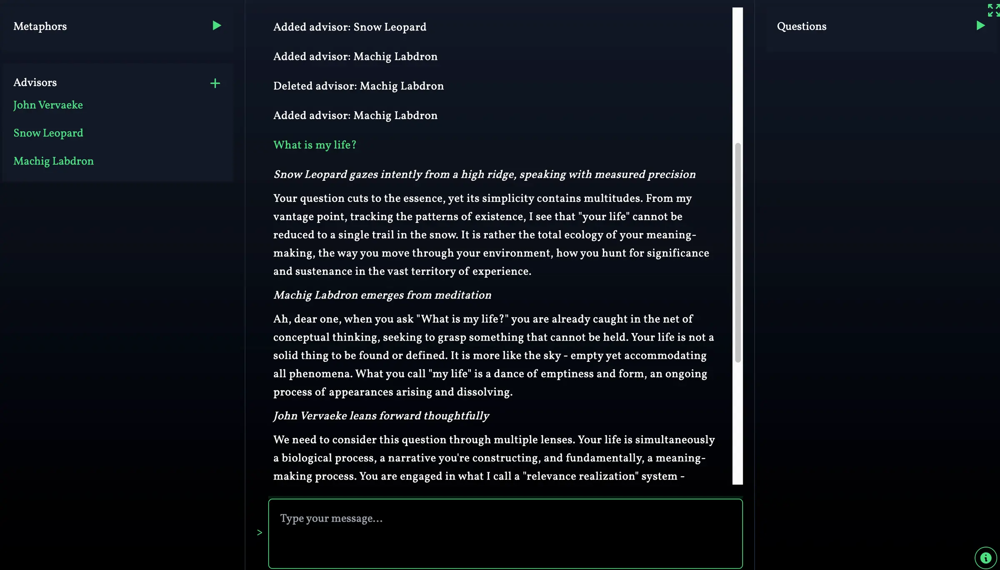

# SPACE Terminal

[SPACE Terminal](https://spaceterminal.xyz) is a terminal-style interface for personal discovery and thinking with large language models. SPACE stands for Simple Perspective-Augmenting Conversation Environment (or maybe, Simulated People Advising Convincingly Enough).

The biggest difference from other chat interfaces is the ability to create and manage AI personas with distinct perspectives, changing them out mid-conversation. For more about AI advisors, see the Insight Cascade process and guidelines here: https://github.com/andrewblevins/insight-cascade. 

SPACE also lets you have much longer conversations without hitting rate limits, a current limitation of Claude Pro.

The app uses Claude 4 Sonnet for the main conversation and GPT-4o for background analysis features like metaphor tracking and question generation (which you can activate by clicking the triangles next to those menus). Model selection is not configurable through the interface yet, if anyone wants to implement that I'd be very grateful.

Currently SPACE will only work well on a desktop or laptop computer. Mobile layout TK.

SPACE uses secure cloud storage with Google authentication to save your conversations and settings. Your data is protected and accessible across devices. (Note: conversations are processed by Anthropic and OpenAI APIs, whose data policies are worth reviewing if this is a concern.)

*SPACE is one node in a larger project exploring frameworks and interfaces for using Large Language Models for personal and social discovery. If you're interested in being a part of a commmunity supporting ongoing dialogue and experimentation around this, sign up for updates here: https://forms.gle/svMNnjJjJdFUjQ9L8.*

## Setup

SPACE Terminal uses Google authentication - simply sign in with your Google account to get started! No API keys required.

### Getting Started

Add your first advisor by clicking the + button on the left side of the screen. Type in a name and click "Generate Description" to get a personality, edit to your liking, then click "Create". 

Make sure the advisors you want to talk to are green (selected).

When you have a board of advisors you like, enter:

> /prompt use "serious-play"

This will send a basic starting prompt for the conversation.

## Features

- **Terminal-Style Interface**: Clean, focused environment for conversation

- **Advisor System**: Create, manage, and generate descriptions for AI personas for varied perspectives

- **Column Layout**: 
  - Left: Metaphor tracking and advisor menu
  - Center: Main conversation area
  - Right: Generated questions for exploration

- **Context Management**: Set token limit beyond which conversation history is shortened (to save tokens/$$$). Past this limit, the LLM will receive the six most recent messages and any messages deemed relevant according to...

- **Tag Analysis**: Background analysis and tracking of conversation themes (currently only used for context management but will be expanded and deepened)

- **Export**: Save your conversation in markdown format

- **Prompts Library**: A library of prompts you can add to, edit, and delete. Also includes a handful of default suggestions

- **Capture**: Right click selected text to capture and save to a Markdown file
- **@ References**: Use `@<session_id>` in a message to insert a brief summary of that past session
- **Debug**: Use the settings menu (gear icon, bottom-left) to toggle debug mode and see what's being sent to Claude plus estimated costs.

## Interface

SPACE has moved to a **fully GUI-based interface** for ease of use. All functionality is accessible through:

- **Settings Menu**: Click the gear icon (bottom-left) for debug mode, token limits, and account settings
- **Advisors Panel**: Left sidebar for creating, editing, and selecting AI advisors  
- **Conversation**: Main terminal area for natural conversation
- **Export Menu**: Click export icon for saving conversations in markdown format
- **Prompts Library**: Access saved prompts through the interface

### Legacy Commands

Some terminal commands are still available for power users:
- `/new` - Start a new session  
- `/debug` - Toggle debug mode
- `/help` - Show available commands

*Note: Advisor sharing, group management, and most other features are now handled through the graphical interface rather than slash commands.*

## Roadmap

- [ ] Worksheet system for reflection and advisor finding
- [ ] Model selection and configuration 
- [ ] Better memory / context management system
- [ ] More conversation analysis tools (interpersonal patterns, Kegan stages, etc.?)
- [x] Advisor sharing through file import/export

## Usage Limits

SPACE Terminal includes a daily message limit to ensure fair usage for all users. You get 25 messages per day, which resets at midnight. This provides plenty of room for deep conversations while keeping the service sustainable. Usage tracking is shown in the settings menu.

## Support

If you've found a bug or have an idea for a feature, contact me at andrew.s.blevins@gmail.com or [@andrew0blevins](https://x.com/andrew0blevins) on Twitter.

## License

Proprietary Software - All Rights Reserved. See LICENSE file for details.

Author: [Andrew Shade Blevins](www.andrewshadeblevins.com)

## Acknowledgments

SPACE Terminal would not be possible without the generous support of the Context Appreciation Society. 

## Security Note

SPACE Terminal uses Google OAuth for secure authentication and stores your data safely in the cloud. API keys are managed server-side, so you don't need to handle them directly. Your conversations are protected with enterprise-grade security and accessible across all your devices.
