# SPACE Terminal - Application Architecture (Post-Phase 1 Refactoring)

This document provides a comprehensive architectural overview of the SPACE Terminal application after the major Phase 1 refactoring that transformed the monolithic Terminal.jsx into a modular hook-based architecture.

## High-Level Architecture Diagram - **NEW MODULAR STRUCTURE**

```mermaid
graph TB
    %% Top Level Application
    subgraph "SPACE Terminal Application - REFACTORED ARCHITECTURE"
        App[App.jsx<br/>Main Router & Theme Provider]
        
        %% NEW: Refactored Terminal Structure
        subgraph "🎯 REFACTORED TERMINAL CORE"
            Terminal[Terminal.jsx<br/>📦 LEAN ORCHESTRATOR<br/>~400 lines - Clean Integration]
            
            %% NEW: Phase 1 Custom Hooks
            subgraph "⚡ PHASE 1 HOOKS - State Management"
                useMessages[useMessages.js<br/>📨 Message Operations<br/>• Message CRUD & streaming<br/>• Context building<br/>• Load/save operations<br/>200 lines]
                useAdvisors[useAdvisors.js<br/>👥 Advisor Management<br/>• Advisor CRUD & groups<br/>• System prompt generation<br/>• Individual contexts<br/>400 lines]
                useModalState[useModalState.js<br/>🎛️ UI State Management<br/>• Modal/panel visibility<br/>• State navigation<br/>• Initialization flags<br/>200 lines]
                useAppSettings[useAppSettings.js<br/>⚙️ Settings & Validation<br/>• App configuration<br/>• Validation & persistence<br/>• Multi-threaded mode<br/>300 lines]
            end
        end
        
        %% Core UI Layer
        subgraph "Core UI Layer"
            MobileLayout[MobileLayout.jsx<br/>Mobile-Responsive Wrapper]
            ResponsiveContainer[ResponsiveContainer.jsx<br/>Adaptive UI Container]
        end
        
        %% Context Providers
        subgraph "Context Layer"
            AuthContext[AuthContext.jsx<br/>Authentication State]
            ModalContext[ModalContext.jsx<br/>Modal Management]
        end
        
        %% UI Modules
        subgraph "Terminal Modules"
            Module[Module.jsx<br/>Base Display Module]
            CollapsibleModule[CollapsibleModule.jsx<br/>Expandable Panels]
            GroupableModule[GroupableModule.jsx<br/>Advisor Grouping System]
            CollapsibleSuggestions[CollapsibleSuggestionsModule.jsx<br/>Interactive Suggestions]
            ExpandingInput[ExpandingInput.jsx<br/>Resizable Text Input]
        end
        
        %% Message Components
        subgraph "Message System"
            MessageRenderer[MessageRenderer.jsx<br/>Message Display Coordinator]
            MemoizedMarkdown[MemoizedMarkdownMessage.jsx<br/>Optimized Markdown]
            AdvisorResponseCard[AdvisorResponseCard.jsx<br/>Individual Advisor Displays]
            AdvisorResponseMessage[AdvisorResponseMessage.jsx<br/>Advisor Message Wrapper]
            ThinkingBlock[ThinkingBlock.jsx<br/>Extended Thinking Display]
            DebateBlock[DebateBlock.jsx<br/>Council Mode Debates]
        end
        
        %% Modal Components
        subgraph "Modal System"
            AdvisorForm[AdvisorForm.jsx<br/>Create Advisors]
            EditAdvisorForm[EditAdvisorForm.jsx<br/>Modify Advisors]
            SettingsMenu[SettingsMenu.jsx<br/>App Configuration]
            VotingModal[VotingModal.jsx<br/>Advisor Voting]
            HighCouncilModal[HighCouncilModal.jsx<br/>Council Mode Setup]
            AssertionsModal[AssertionsModal.jsx<br/>Claim Verification]
            EvaluationsModal[EvaluationsModal.jsx<br/>Advisor Improvement]
            DossierModal[DossierModal.jsx<br/>User Profiles]
            ImportExportModal[ImportExportModal.jsx<br/>Data Management]
            HelpModal[HelpModal.jsx<br/>User Documentation]
            InfoModal[InfoModal.jsx<br/>System Information]
            MigrationModal[MigrationModal.jsx<br/>Data Migration]
        end
        
        %% API Hooks Layer
        subgraph "API Integration Hooks"
            useClaude[useClaude.js<br/>Claude Sonnet 4 API<br/>Primary AI Integration]
            useOpenRouter[useOpenRouter.js<br/>OpenRouter API<br/>Multi-Model Access]
            useOpenAI[useOpenAI.js<br/>OpenAI GPT-4o-mini<br/>Analysis Functions]
            useGemini[useGemini.js<br/>Google Gemini<br/>Evaluation System]
            useUsageTracking[useUsageTracking.js<br/>Cost & Usage Analytics]
            useConversationStorage[useConversationStorage.js<br/>Database Operations]
        end
        
        %% Core Libraries
        subgraph "Core Libraries"
            MemorySystem[memory.ts<br/>Context Management<br/>Token Limit Handling]
            TagAnalyzer[tagAnalyzer.js<br/>Message Classification<br/>Shared Instance]
            DefaultPrompts[defaultPrompts.js<br/>System Prompt Templates]
            AdvisorColors[advisorColors.js<br/>Color Assignment System]
        end
        
        %% Utilities Layer
        subgraph "Utilities Layer"
            TerminalHelpers[terminalHelpers.js<br/>Analysis Pipeline<br/>Context Building]
            SecureStorage[secureStorage.js<br/>Encrypted API Keys<br/>AES-256 Encryption]
            UsageTracking[usageTracking.js<br/>Cost Calculation<br/>Usage Analytics]
            ApiConfig[apiConfig.js<br/>Endpoint Management]
            ApiErrorHandler[apiErrorHandler.js<br/>Error Management]
            Analytics[analytics.js<br/>Event Tracking]
            MigrationHelper[migrationHelper.js<br/>Data Migration Utils]
            WorksheetTemplates[worksheetTemplates.js<br/>Structured Prompts]
            EvaluationHelpers[evaluationHelpers.js<br/>Advisor Assessment]
            AutomationHelpers[automationHelpers.js<br/>Browser Testing Utils]
        end
        
        %% Backend Functions
        subgraph "Backend API (Cloudflare Functions)"
            subgraph "Chat Endpoints"
                ClaudeAPI[claude.js<br/>Claude API Proxy]
                OpenRouterAPI[openrouter.js<br/>OpenRouter Proxy]
                OpenAIAPI[openai.js<br/>OpenAI Proxy]
                GeminiAPI[gemini.js<br/>Gemini Proxy]
            end
            
            subgraph "Data Endpoints"
                ConversationsAPI[conversations/index.js<br/>Conversation CRUD]
                ConversationByID[conversations/id.js<br/>Individual Conversations]
                MessagesAPI[conversations/id/messages.js<br/>Message Management]
                UsageAPI[usage.js<br/>Usage Statistics]
                HealthAPI[health.js<br/>System Status]
            end
            
            subgraph "Infrastructure"
                AuthUtils[utils/auth.js<br/>JWT Validation<br/>User Authentication]
                DatabaseUtils[utils/database.js<br/>Supabase Operations]
                RateLimiting[middleware/rateLimiting.js<br/>Request Throttling]
            end
        end
        
        %% External Services
        subgraph "External Services"
            Supabase[(Supabase<br/>PostgreSQL Database<br/>User Auth & Data)]
            ClaudeService[Claude Sonnet 4<br/>Primary AI Service]
            OpenAIService[OpenAI GPT-4o-mini<br/>Analysis Service]
            GeminiService[Google Gemini Pro<br/>Evaluation Service]
            OpenRouterService[OpenRouter<br/>Multi-Model Access]
        end
        
        %% FUTURE: Phase 2 Hooks (Ready for Multi-Threading)
        subgraph "🚀 PHASE 2 HOOKS - Business Logic (Future)"
            useConversationAnalysis[useConversationAnalysis.js<br/>📊 Analysis Pipeline<br/>• Metaphor generation<br/>• Question extraction<br/>• Session summaries]
            useMessageSending[useMessageSending.js<br/>📤 Message Orchestration<br/>• Multi-threaded API calls<br/>• Individual advisor contexts<br/>• Parallel processing]
        end
    end
    
    %% NEW: Hook-Based Data Flow
    App --> Terminal
    App --> AuthContext
    App --> ModalContext
    
    %% Terminal now uses hooks instead of direct state
    Terminal -.->|uses| useMessages
    Terminal -.->|uses| useAdvisors
    Terminal -.->|uses| useModalState
    Terminal -.->|uses| useAppSettings
    Terminal -.->|future| useConversationAnalysis
    Terminal -.->|future| useMessageSending
    
    %% Hook dependencies
    useMessages --> MemorySystem
    useAdvisors --> AdvisorColors
    useAdvisors --> DefaultPrompts
    useAppSettings --> SecureStorage
    
    Terminal --> MobileLayout
    Terminal --> ResponsiveContainer
    Terminal --> Module
    Terminal --> CollapsibleModule
    Terminal --> GroupableModule
    Terminal --> MessageRenderer
    Terminal --> AdvisorForm
    Terminal --> SettingsMenu
    Terminal --> VotingModal
    Terminal --> HighCouncilModal
    
    Terminal --> useClaude
    Terminal --> useOpenRouter
    Terminal --> useOpenAI
    Terminal --> useGemini
    Terminal --> useConversationStorage
    
    MessageRenderer --> MemoizedMarkdown
    MessageRenderer --> AdvisorResponseCard
    MessageRenderer --> ThinkingBlock
    MessageRenderer --> DebateBlock
    
    useClaude --> MemorySystem
    useClaude --> TerminalHelpers
    useClaude --> SecureStorage
    useClaude --> UsageTracking
    useClaude --> ClaudeAPI
    
    useOpenRouter --> OpenRouterAPI
    useOpenAI --> OpenAIAPI
    useGemini --> GeminiAPI
    
    ClaudeAPI --> ClaudeService
    OpenRouterAPI --> OpenRouterService
    OpenAIAPI --> OpenAIService
    GeminiAPI --> GeminiService
    
    useConversationStorage --> ConversationsAPI
    ConversationsAPI --> DatabaseUtils
    DatabaseUtils --> Supabase
    
    AuthContext --> AuthUtils
    AuthUtils --> Supabase
    
    TerminalHelpers --> MemorySystem
    SecureStorage --> ModalContext
    
    %% Multi-Threading Ready Flow
    useMessageSending -.->|future| useMessages
    useMessageSending -.->|future| useAdvisors
    useConversationAnalysis -.->|future| useMessages
    
    %% Updated Styling
    classDef coreComponent fill:#e1f5fe,stroke:#01579b,stroke-width:2px
    classDef newHook fill:#c8e6c9,stroke:#388e3c,stroke-width:3px
    classDef futureHook fill:#fff3e0,stroke:#f57c00,stroke-width:2px,stroke-dasharray: 5 5
    classDef apiHook fill:#f3e5f5,stroke:#4a148c,stroke-width:2px
    classDef utility fill:#e8f5e8,stroke:#1b5e20,stroke-width:2px
    classDef backend fill:#fff3e0,stroke:#e65100,stroke-width:2px
    classDef external fill:#fce4ec,stroke:#880e4f,stroke-width:2px
    classDef modal fill:#f1f8e9,stroke:#33691e,stroke-width:2px
    
    class Terminal,MessageRenderer,MobileLayout coreComponent
    class useMessages,useAdvisors,useModalState,useAppSettings newHook
    class useConversationAnalysis,useMessageSending futureHook
    class useClaude,useOpenRouter,useOpenAI,useGemini apiHook
    class TerminalHelpers,SecureStorage,UsageTracking,MemorySystem utility
    class ClaudeAPI,OpenRouterAPI,ConversationsAPI,DatabaseUtils backend
    class Supabase,ClaudeService,OpenAIService,GeminiService external
    class AdvisorForm,SettingsMenu,VotingModal,HighCouncilModal modal
```



## Key Architectural Components

### 1. **Terminal.jsx - Lean Orchestrator (~400 lines)**
- **Role**: Clean integration hub using custom hooks
- **State Management**: Delegates to specialized hooks instead of direct useState
- **Key Responsibilities**:
  - Hook coordination and integration
  - UI event handling
  - Component rendering orchestration
  - Minimal state management (UI flags only)

### 2. **API Integration Strategy**
- **Primary AI**: Claude Sonnet 4 via `useClaude` hook
- **Analysis**: OpenAI GPT-4o-mini for metaphors/questions/suggestions  
- **Evaluation**: Gemini Pro for advisor improvement system
- **Multi-Model**: OpenRouter for additional model access
- **Streaming**: Real-time response rendering with token estimation

### 3. **Data Flow Architecture**
```
User Input → Terminal.jsx → API Hook → Backend Proxy → AI Service
                ↓
Message Processing ← Streaming Response ← API Response
        ↓
State Update → UI Refresh → Analysis Triggers
```

### 4. **Current Advisor System**
- **Single-Thread**: All advisors combined in one system prompt
- **System Prompt Generation**: `getSystemPrompt()` in useAdvisors.js hook
- **Individual Context Ready**: `getIndividualSystemPrompt()` prepared for multi-threading
- **Response Format**: JSON structure with all advisor responses
- **Council Mode**: Structured debate format with rounds

### 5. **Context Management**
- **Memory System**: `memory.ts` handles token limits and context pruning
- **Context Limit**: 150,000 characters before pruning
- **Tag Analysis**: Automatic message classification and reference system
- **Session References**: @ syntax for referencing previous conversations

### 6. **Security Architecture**  
- **API Keys**: AES-256 encrypted browser storage via `secureStorage.js`
- **Authentication**: Google OAuth via Supabase Auth (optional)
- **Backend Proxy**: Cloudflare Functions proxy for authenticated API access
- **Rate Limiting**: Request throttling middleware

### 7. **Storage Modes**
- **Local Mode**: `VITE_USE_AUTH=false` - localStorage persistence
- **Database Mode**: `VITE_USE_AUTH=true` - Supabase integration

## Multi-Threaded Advisor Implementation Points

Based on this refactored architecture, the multi-threaded advisor system would primarily involve:

1. **Phase 2 Hooks Implementation**: 
   - `useMessageSending.js`: Parallel API call orchestration for individual advisors
   - `useConversationAnalysis.js`: Business logic for analysis pipeline
   - Multi-threaded mode toggle in `useAppSettings.js`

2. **Enhanced useAdvisors.js**:
   - `getIndividualSystemPrompt()` already prepared for single-advisor contexts
   - Individual advisor context building utilities
   - Parallel response coordination logic

3. **API Hook Modifications**:
   - `useClaude.js`: Support for individual advisor API calls
   - Streaming coordination for multiple parallel responses
   - Response aggregation and UI update patterns

4. **UI Enhancements**:
   - `MessageRenderer.jsx`: Individual advisor response display
   - Threading-aware message organization
   - Progressive response rendering

The refactored modular architecture with focused custom hooks provides an ideal foundation for implementing multi-threaded conversations with minimal disruption to existing functionality.